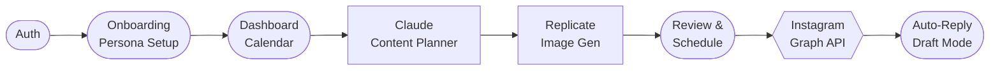

# Virtual Prism 🌈

> **B2B AI 虛擬網紅自動化營運平台 MVP**

讓代理商能在一分鐘內「創建」一個具備長期記憶與互動能力的 AI 網紅，並接管其日常內容生產。

## 產品定位

- **目標客群**：B2B（品牌主 / 行銷代理商）
- **核心價值**：人設驅動 → 自動生成一週內容 → 一鍵發布 IG → 自動互動回覆

## 用戶旅程

1. **Onboarding**：上傳 1-3 張參考圖 + 一句話描述
2. **Setup**：AI 反推外觀特徵 + 生成人設卡，用戶確認
3. **Generation**：系統自動規劃未來 7 天圖文內容
4. **Review**：審核後台預覽，支援一鍵重繪
5. **Publish**：排程發布至 Instagram
6. **Engage**：粉絲留言自動回覆（草稿模式）

## 技術棧

| 層次 | 技術 |
|------|------|
| 前端 | Next.js 14 (App Router, TypeScript) |
| 後端 | Python FastAPI |
| 關係型 DB | PostgreSQL |
| Vector DB | Pinecone |
| 生圖引擎 | ComfyUI + Stable Diffusion SDXL/Flux |
| LLM | Claude 3.5 Sonnet / GPT-4o |
| 視覺反推 | GPT-4o Vision |
| 發布 | Instagram Graph API |
| 前端部署 | Vercel |
| 後端部署 | Docker + Railway |

## 專案結構

```
virtual-prism/
├── frontend/          # Next.js 前端
│   ├── app/           # App Router 頁面
│   ├── components/    # 共用元件
│   └── lib/           # API 呼叫、工具函式
├── backend/           # Python FastAPI 後端
│   ├── app/
│   │   ├── api/       # 路由端點
│   │   ├── services/  # 業務邏輯
│   │   └── models/    # 資料模型
│   ├── requirements.txt
│   └── Dockerfile
└── docs/              # 技術文件
```

## 本地啟動

### 前提條件
- Node.js 18+
- Python 3.11+
- PostgreSQL
- ComfyUI（本地安裝或遠端）

### 後端
```bash
cd backend
cp .env.example .env   # 填入 API Keys
pip install -r requirements.txt
uvicorn app.main:app --reload
```

### 前端
```bash
cd frontend
cp .env.example .env.local
npm install
npm run dev
```

## MVP 驗收標準（AC）

跑通完整用戶旅程：上傳參考圖 → AI 生成人設卡 → 自動規劃一週內容 → 審核後台預覽 → 一鍵排程發布至 IG。系統可內部 Demo 穩定運行。

## 開發狀態

目前專案處於 MVP 開發階段，核心功能持續迭代中。

## Architecture

Virtual Prism is built on a Next.js 14 frontend and a Python FastAPI backend. The core pipeline flows from user auth → persona onboarding → AI content planning (Claude) → image generation (Replicate/flux) → scheduling → Instagram Graph API publishing, with a draft-mode auto-reply system on top.

For the complete architecture covering all flows and subsystems, see **[docs/ARCHITECTURE.md](docs/ARCHITECTURE.md)**. Individual per-flow Mermaid diagrams live under [`docs/flows/`](docs/flows/).

High-level overview:



## 相關連結

- [Epic Issue](https://github.com/brunella328/my-first-business/issues/25)
- [執行追蹤 Project](https://github.com/users/brunella328/projects/4)

## 系統架構

完整的產品架構流程圖請參考 [docs/ARCHITECTURE.md](docs/ARCHITECTURE.md)。

架構文件包含 10 個獨立的 Mermaid 流程圖，涵蓋認證、入門設定、貼文生成、聊天發文、排程發布、自動回覆等完整流程。
