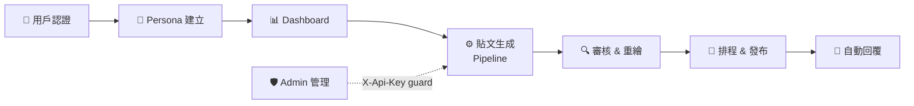

# Virtual Prism — 系統架構文件

> 本文件為 Virtual Prism 完整產品流程的架構說明。各流程拆分為獨立檔案方便閱讀，並可在支援 Mermaid 的工具中直接渲染。

## 流程總覽

## 流程目錄

| # | 流程 | 說明 | 檔案 |
|---|------|------|------|
| 01 | 用戶認證 | 註冊、信箱驗證、登入、JWT | [01-auth.mmd](flows/01-auth.mmd) |
| 02 | Persona 建立 | 人臉上傳、AI 分析、人設卡 | [02-onboarding.mmd](flows/02-onboarding.mmd) |
| 03 | Dashboard | 月曆、週曆、貼文面板 | [03-dashboard.mmd](flows/03-dashboard.mmd) |
| 04 | 內容類型選擇 | 5 種類型 + 聊天發文（即將推出）| [04-content-types.mmd](flows/04-content-types.mmd) |
| 05 | 貼文生成 Pipeline | Claude → Replicate → Cloudinary → 排程 | [05-post-generation.mmd](flows/05-post-generation.mmd) |
| 06 | 聊天發文 ✨ | AI 引導對話生成長文（即將推出）| [06-chat-to-post.mmd](flows/06-chat-to-post.mmd) |
| 07 | 審核與重繪 | 審核、編輯標題、重新生成 | [07-review-regenerate.mmd](flows/07-review-regenerate.mmd) |
| 08 | 排程與發布 | Instagram OAuth、Graph API 發布 | [08-scheduling-publishing.mmd](flows/08-scheduling-publishing.mmd) |
| 09 | 自動回覆 | 評論監控、Claude 草稿、發布 | [09-auto-reply.mmd](flows/09-auto-reply.mmd) |
| 10 | Admin 管理 | 配額調整、強制驗證、備份 | [10-admin.mmd](flows/10-admin.mmd) |

## 技術棧

| 層次 | 技術 |
|------|------|
| Frontend | Next.js 14 (App Router, TypeScript) |
| Backend | Python FastAPI |
| AI / LLM | Claude Haiku (content planning, vision, auto-reply) |
| Image Gen | Replicate — flux-kontext-max (face ref) / flux-dev-realism (no face ref) |
| Storage | JSON flat-file store (schedule, personas, tokens) |
| Infra | Cloudinary CDN · Instagram Graph API · Resend Email |

## Node Colour Key

| Colour | Meaning |
|--------|---------|
| 🟣 Purple | User-facing screens / React components |
| 🔵 Blue | Backend API endpoints & internal services |
| 🟠 Amber | External third-party services |
| 🟢 Green | Persistent storage (JSON files / CDN) |
| ⚫ Grey dashed | Planned / coming-soon features |

## Key Design Decisions

**Dual image-generation mode** — when a persona has a `reference_face_url` (uploaded during onboarding), `flux-kontext-max` is used to preserve face consistency across all posts. Without a face reference, `flux-dev-realism` is used instead.

**V7 LDR realism prompt** — all image prompts are augmented with a low-dynamic-range, "unedited mobile photo" suffix to make AI-generated images harder to detect as synthetic.

**Quota system** — each account is limited to `POST_QUOTA = 3` generated posts. Admins can reset or add quota via the `/api/admin/quota/adjust` endpoint, protected by `X-Api-Key`.

**Backup scheduler** — a background asyncio task runs every 6 hours and tars the `data/` directory; manual on-demand backups are available via `/api/admin/backup`.

**Auto-reply draft mode** — Claude generates reply candidates but a human must approve before the comment is posted to Instagram, preventing brand risk from unsupervised AI responses.
