```mermaid
flowchart TD

    %% ─────────────────────────────────────────────
    %% Node classes
    %% ─────────────────────────────────────────────
    classDef screen   fill:#7c3aed,color:#fff,stroke:#5b21b6,rx:8
    classDef api      fill:#1d4ed8,color:#fff,stroke:#1e3a8a,rx:4
    classDef ext      fill:#d97706,color:#fff,stroke:#92400e,rx:4
    classDef store    fill:#15803d,color:#fff,stroke:#14532d,rx:4
    classDef soon     fill:#9ca3af,color:#fff,stroke:#6b7280,rx:4,stroke-dasharray:6 3

    %% ─────────────────────────────────────────────
    %% 0. AUTH FLOW
    %% ─────────────────────────────────────────────
    subgraph AUTH["🔐 User Authentication"]
        direction TB
        A1([Register Page]):::screen
        A2([Login Page]):::screen
        A3([Verify Email Page]):::screen
        A4[POST /api/auth/register]:::api
        A5[POST /api/auth/login]:::api
        A6[GET  /api/auth/verify-email]:::api
        A7[(Users JSON Store)]:::store
        A8{{Resend — Email Service}}:::ext
        A9[JWT Cookie — 14 days]:::store

        A1 -->|email + password| A4
        A4 -->|bcrypt hash + uuid| A7
        A4 -->|verification link| A8
        A8 -->|email to user| A3
        A3 -->|?token=xxx| A6
        A6 -->|mark verified| A7
        A6 --> A9
        A2 -->|email + password| A5
        A5 -->|check hash| A7
        A5 --> A9
    end

    %% ─────────────────────────────────────────────
    %% 1. ONBOARDING — PERSONA CREATION
    %% ─────────────────────────────────────────────
    subgraph ONBOARD["🧬 Onboarding — Persona Setup"]
        direction TB
        B1([Onboarding Page]):::screen
        B2[POST /api/genesis/analyze-appearance]:::api
        B3[POST /api/genesis/create-persona]:::api
        B4[PATCH /api/genesis/persona/:id]:::api
        B5{{Claude Vision — Haiku}}:::ext
        B6{{Cloudinary CDN}}:::ext
        B7[(Personas JSON Store)]:::store
        B8([PersonaCard Component]):::screen

        B1 -->|"① upload 1–3 face photos"| B2
        B2 -->|base64 images| B5
        B5 -->|"appearance JSON\n(facial_features, image_prompt…)"| B2
        B1 -->|"② one-sentence description\n+ content_types"| B3
        B3 -->|description| B5
        B5 -->|"persona JSON\n(name, occupation, personality…)"| B3
        B1 -->|face photo| B6
        B6 -->|reference_face_url| B3
        B3 -->|auto-confirm + save| B7
        B3 -->|auto-generate example post| B5
        B4 -->|partial update| B7
        B7 --> B8
    end

    %% ─────────────────────────────────────────────
    %% 2. DASHBOARD
    %% ─────────────────────────────────────────────
    subgraph DASH["📊 Dashboard"]
        direction LR
        C1([Dashboard Page]):::screen
        C2([MonthCalendar Component]):::screen
        C3([Post Detail Panel]):::screen
        C4([WeekCalendar Component]):::screen

        C1 --> C2
        C1 --> C3
        C1 --> C4
    end

    %% ─────────────────────────────────────────────
    %% 3. CONTENT TYPE SELECTION
    %% ─────────────────────────────────────────────
    subgraph CTYPES["🎨 Content Type Selection"]
        direction LR
        D1{Select Content Type}
        D2["📚 Educational\n(知識分享)"]
        D3["🎉 Entertainment\n(娛樂互動)"]
        D4["📢 Promotional\n(產品推廣)"]
        D5["💬 Engagement\n(社群互動)"]
        D6["📖 Personal Story\n(個人故事)"]
        D7["💬 Chat Post — 聊天發文\n(Coming Soon)"]:::soon

        D1 --> D2 & D3 & D4 & D5 & D6
        D1 -.->|"coming soon"| D7
    end

    %% ─────────────────────────────────────────────
    %% 4A. STANDARD POST GENERATION PIPELINE
    %% ─────────────────────────────────────────────
    subgraph PIPELINE["⚙️ Post Generation Pipeline"]
        direction TB
        E1[AddPostModal — date + type + hint]:::screen
        E2[POST /api/life-stream/generate-post/:persona_id]:::api
        E3[POST /api/life-stream/generate-schedule/:persona_id]:::api
        E4{{Claude Haiku — Content Planner}}:::ext
        E5[comfyui_service.build_realism_prompt]:::api
        E6{Has face reference URL?}
        E7{{Replicate — flux-kontext-max\nMode A: face consistency}}:::ext
        E8{{Replicate — flux-dev-realism\nMode B: no face ref}}:::ext
        E9{{Cloudinary CDN}}:::ext
        E10[(Schedule JSON Store)]:::store
        E11[Quota check — POST_QUOTA = 3]:::api
        E12[increment_posts_generated]:::api

        E1 -->|single post| E2
        C2 -->|"3-day batch"| E3
        E2 & E3 --> E11
        E11 -->|ok| E4
        E4 -->|"scene_prompt + caption\n+ hashtags JSON"| E5
        E5 -->|"V7 LDR realism prompt\n(character + scene + camera)"| E6
        E6 -->|yes → Mode A| E7
        E6 -->|no  → Mode B| E8
        E7 & E8 -->|Replicate image URL| E9
        E9 -->|CDN URL| E10
        E10 -->|"draft post\n(status: draft)"| E12
        E12 --> A7
    end

    %% ─────────────────────────────────────────────
    %% 4B. COMING SOON — 聊天發文
    %% ─────────────────────────────────────────────
    subgraph CHATPOST["💬 聊天發文 Flow (Coming Soon)"]
        direction TB
        F1([User enters topic]):::soon
        F2["AI asks clarifying\nquestions"]:::soon
        F3([User answers]):::soon
        F4["AI synthesises\nideas"]:::soon
        F5([Draft edit screen]):::soon
        F6([Schedule / publish]):::soon

        F1 --> F2 --> F3 --> F4 --> F5 --> F6
    end

    %% ─────────────────────────────────────────────
    %% 5. REVIEW & REGENERATE
    %% ─────────────────────────────────────────────
    subgraph REVIEW["🔍 Review & Regenerate"]
        direction TB
        G1([Post Detail Panel]):::screen
        G2[PATCH /schedule/:id/:post_id/status]:::api
        G3[PATCH /schedule/:id/:post_id/content]:::api
        G4[POST /api/life-stream/regenerate/:content_id]:::api
        G5[POST /api/image/generate]:::api
        G6[POST /api/image/retest]:::api
        G7{{Hive AI Detector}}:::ext

        G1 -->|"approve / reject"| G2
        G1 -->|"edit caption + scene_prompt"| G3
        G1 -->|"one-click redraw"| G4
        G4 --> E5
        G5 -->|"dev retest"| G6
        G6 --> G7
        G7 -->|"hive_score < 0.3 → pass"| G6
    end

    %% ─────────────────────────────────────────────
    %% 6. SCHEDULING
    %% ─────────────────────────────────────────────
    subgraph SCHED["📅 Scheduling"]
        direction TB
        H1([Schedule Page]):::screen
        H2[PATCH /schedule/:id/:post_id/scheduled-at]:::api
        H3[PATCH /schedule/:id/:post_id/status → scheduled]:::api
        H4[(Schedule JSON — scheduled_at, job_id)]:::store

        H1 -->|set scheduled_at| H2
        H2 --> H4
        H3 --> H4
    end

    %% ─────────────────────────────────────────────
    %% 7. INSTAGRAM OAUTH & PUBLISHING
    %% ─────────────────────────────────────────────
    subgraph IGPUB["📸 Instagram OAuth & Publishing"]
        direction TB
        I1([Instagram Connect Button]):::screen
        I2{{Instagram Graph API — OAuth}}:::ext
        I3[(instagram_tokens.json)]:::store
        I4[Scheduled job fires at scheduled_at]:::api
        I5{{Instagram Graph API — Media Create}}:::ext
        I6{{Instagram Graph API — Media Publish}}:::ext
        I7[status → published]:::store

        I1 -->|"OAuth redirect"| I2
        I2 -->|"access_token"| I3
        I4 -->|read token| I3
        I4 --> I5
        I5 -->|"creation_id"| I6
        I6 --> I7
    end

    %% ─────────────────────────────────────────────
    %% 8. AUTO-REPLY (草稿模式)
    %% ─────────────────────────────────────────────
    subgraph AUTOREPLY["💬 Auto-Reply (Draft Mode)"]
        direction TB
        J1[Poll IG comments via Graph API]:::api
        J2{{Claude — Reply Generator}}:::ext
        J3([Draft reply review UI]):::screen
        J4{{Instagram Graph API — Post Comment}}:::ext

        J1 -->|"new comments"| J2
        J2 -->|"AI-drafted reply"| J3
        J3 -->|"human approves"| J4
    end

    %% ─────────────────────────────────────────────
    %% 9. ADMIN QUOTA MANAGEMENT
    %% ─────────────────────────────────────────────
    subgraph ADMIN["🛡️ Admin — Quota Management"]
        direction LR
        K1[POST /api/admin/quota/adjust]:::api
        K2[POST /api/admin/force-verify]:::api
        K3[POST /api/admin/backup]:::api
        K4[(Users JSON Store)]:::store
        K5[backup_service — 6h cron]:::api
        K6[(Backup .tar.gz)]:::store

        K1 -->|"add or reset posts_generated"| K4
        K2 -->|"force email_verified = true"| K4
        K3 --> K5
        K5 --> K6
    end

    %% ─────────────────────────────────────────────
    %% TOP-LEVEL CONNECTIONS
    %% ─────────────────────────────────────────────
    AUTH        --> ONBOARD
    ONBOARD     --> DASH
    DASH        --> CTYPES
    CTYPES      --> PIPELINE
    D7          -.-> CHATPOST
    PIPELINE    --> REVIEW
    REVIEW      --> SCHED
    SCHED       --> IGPUB
    IGPUB       --> AUTOREPLY
    ADMIN       -.->|"X-Api-Key guard"| PIPELINE
```

# Virtual Prism — Architecture Flow

Virtual Prism is a B2B AI virtual influencer automation platform. Agencies create a persona in minutes, let the AI generate a week's worth of Instagram content, schedule it, and auto-reply to comments — all without touching a camera.

The diagram below traces every major flow: authentication, onboarding, the five content-type paths (including the upcoming 聊天發文 conversational post mode), the image-generation pipeline, scheduling, Instagram OAuth publishing, auto-reply, and admin quota management.

---

---

## Node Colour Key

| Colour | Meaning |
|--------|---------|
| 🟣 Purple | User-facing screens / React components |
| 🔵 Blue | Backend API endpoints & internal services |
| 🟠 Amber | External third-party services |
| 🟢 Green | Persistent storage (JSON files / CDN) |
| ⚫ Grey dashed | Planned / coming-soon features |

---

## Key Design Decisions

**Dual image-generation mode** — when a persona has a `reference_face_url` (uploaded during onboarding), `flux-kontext-max` is used to preserve face consistency across all posts. Without a face reference, `flux-dev-realism` is used instead.

**V7 LDR realism prompt** — all image prompts are augmented with a low-dynamic-range, "unedited mobile photo" suffix to make AI-generated images harder to detect as synthetic.

**Quota system** — each account is limited to `POST_QUOTA = 3` generated posts. Admins can reset or add quota via the `/api/admin/quota/adjust` endpoint, protected by `X-Api-Key`.

**Backup scheduler** — a background asyncio task runs every 6 hours and tars the `data/` directory; manual on-demand backups are available via `/api/admin/backup`.

**Auto-reply draft mode** — Claude generates reply candidates but a human must approve before the comment is posted to Instagram, preventing brand risk from unsupervised AI responses.
